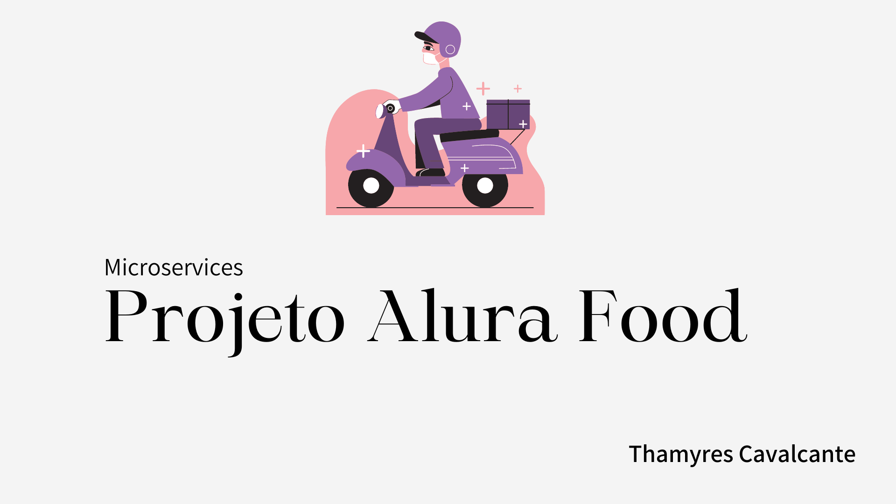

| :placard: Vitrine.Dev |     |
| -------------  | --- |
| :sparkles: Nome        | **MicroServices Alura Food**
| :label: Tecnologias | Java, Spring Boot, MySQL
| :rocket: URL         | thamyresmya.github.io/Space_alura/
| :fire: Desafio     | 

 

 

# MicroServices Alura Food

Implementação com java e Spring de microsserviços.

 

  <a href="#-tecnologias">Tecnologias</a>&nbsp;&nbsp;&nbsp;|&nbsp;&nbsp;&nbsp;  
  <a href="#-projeto">Projeto</a>&nbsp;&nbsp;&nbsp;|&nbsp;&nbsp;&nbsp;  
  <a href="#-gif">Gif</a>&nbsp;&nbsp;&nbsp;&nbsp;&nbsp;&nbsp;

 

## 🚀 Tecnologias

Esse projeto foi desenvolvido com as seguintes tecnologias:

- Java
- Spring Boot
- MySQL
- Git e Github

 

## 💻 Projeto

Projeto desenvolvido durante o curso de Microsserviços implementado com Java e Spring
- Criação de um microsserviço com Java e Spring, conectado a um banco de dados MySQL
- Implementação de técnica de service discovery utilizando o Eureka
- Centralização de requisições adicionando um API Gateway ao projeto
- Comunicação síncrona entre dois microsserviços com Open Feign
- Entenda os conceitos de circuit breaker e fallback

 

## 📁 Acesso ao projeto

Os códigos podem ser acessados através desse [Link](https://github.com/Thamyresmya/Microsservico-Alura_Food)

 

Me siga nas redes sociais:
- [Linkedin](https://www.linkedin.com/in/thamyrescavalcante/)
- [Instagran](https://www.instagram.com/thamyres__cavalcante/)

 

---

Feito com ♥ by Thamyres Cavalcante.

